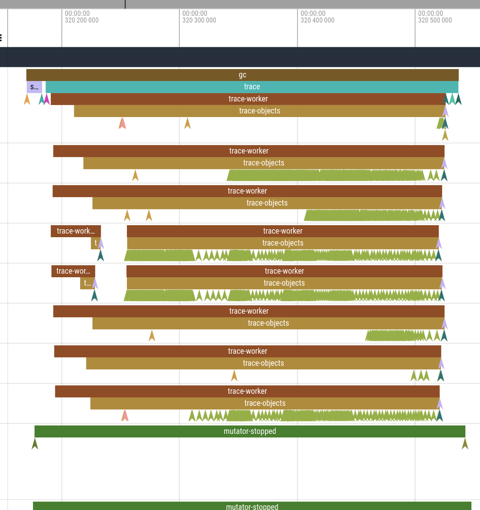

# Whippet performance tracing

Whippet includes support for run-time tracing via
[LTTng](https://LTTng.org) user-space tracepoints.  This allows you to
get a detailed look at how Whippet is performing on your system.
Tracing support is currently limited to Linux systems.

## Getting started

First, you need to build Whippet with LTTng support.  Usually this is as
easy as building it in an environment where the `lttng-ust` library is
present, as determined by `pkg-config --libs lttng-ust`.  You can know
if your Whippet has tracing support by seeing if the resulting binaries
are dynamically linked to `liblttng-ust`.

If we take as an example the `mt-gcbench` test in the Whippet source
tree, we would have:

```
$ ldd bin/mt-gcbench.pcc | grep lttng
...
liblttng-ust.so.1 => ...
...
```

### Capturing traces

Actually capturing traces is a little annoying; it's not as easy as
`perf run`.  The [LTTng
documentation](https://lttng.org/docs/v2.13/#doc-controlling-tracing) is
quite thorough, but here is a summary.

First, create your tracing session:

```
$ lttng create
Session auto-20250214-091153 created.
Traces will be output to ~/lttng-traces/auto-20250214-091153
```

You run all these commands as your own user; they don't require root
permissions or system-wide modifications, as all of the Whippet
tracepoints are user-space tracepoints (UST).

Just having an LTTng session created won't do anything though; you need
to configure the session.  Monotonic nanosecond-resolution timestamps
are already implicitly part of each event.  We also want to have process
and thread IDs for all events:

```
$ lttng add-context --userspace --type=vpid --type=vtid
ust context vpid added to all channels
ust context vtid added to all channels
```

Now enable Whippet events:

```
$ lttng enable-event --userspace 'whippet:*'
ust event whippet:* created in channel channel0
```

And now, start recording:

```
$ lttng start
Tracing started for session auto-20250214-091153
```

With this, traces will be captured for our program of interest:

```
$ bin/mt-gcbench.pcc 2.5 8
...
```

Now stop the trace:

```
$ lttng stop
Waiting for data availability
Tracing stopped for session auto-20250214-091153
```

Whew.  If we did it right, our data is now in
~/lttng-traces/auto-20250214-091153.

### Visualizing traces

LTTng produces traces in the [Common Trace Format
(CTF)](https://diamon.org/ctf/).  My favorite trace viewing tool is the
family of web-based trace viewers derived from `chrome://tracing`.  The
best of these appear to be [the Firefox
profiler](https://profiler.firefox.com) and
[Perfetto](https://ui.perfetto.dev).  Unfortunately neither of these can
work with CTF directly, so we instead need to run a trace converter.

Oddly, there is no trace converter that can read CTF and write something
that Perfetto (e.g.) can read.  However there is a JSON-based tracing
format that Perfetto can read, and [Python bindings for Babeltrace, a
library that works with CTF](https://babeltrace.org/), so that's what we
do:

```
$ python3 ctf_to_json.py ~/lttng-traces/auto-20250214-091153 > trace.json
```

While Firefox Profiler can load this file, it works better on Perfetto,
as the Whippet events are visually rendered on their respective threads.



### Expanding the set of events

As of February 2025,
the current set of tracepoints includes the [heap
events](https://github.com/wingo/whippet/blob/main/doc/manual.md#statistics)
and some detailed internals of the parallel tracer.  We expect this set
of tracepoints to expand over time.

### Overhead of tracepoints

When tracepoints are compiled in but no events are enabled, tracepoints
appear to have no impact on run-time.  When event collection is on, for
x86-64 hardware, [emitting a tracepoint event takes about
100ns](https://discuss.systems/@DesnoyersMa/113986344940256872).
